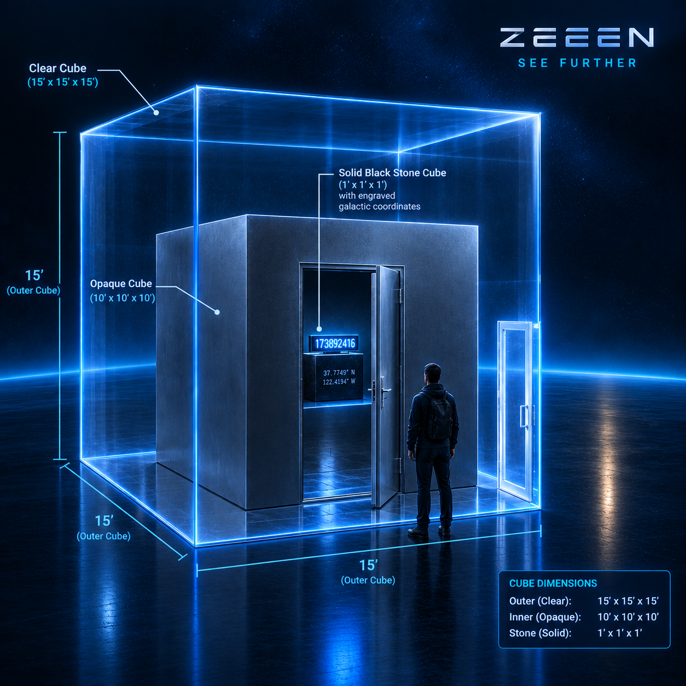
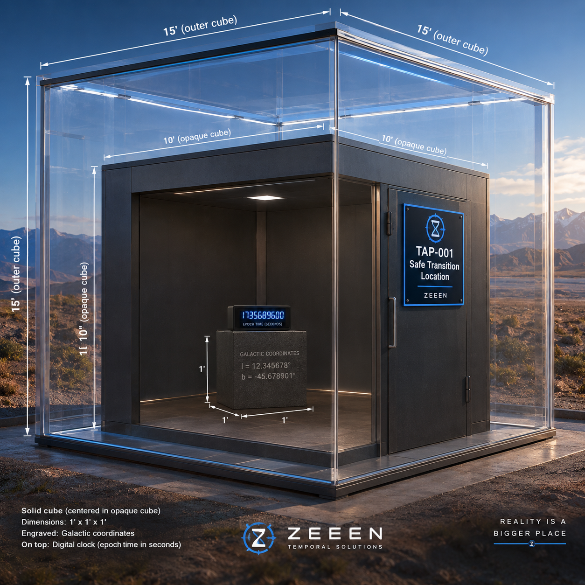

# 1. Project Purpose

TAP is a protocol for evaluating a future entity that claims to have established contact with the present through temporal displacement.

The protocol deliberately separates three questions:

1. **Immediate cryptographic authentication:** Can a received message be verified as having been produced with the designated historical secret?
2. **Historical event evidence:** Was the designated authentication material physically instantiated during a defined historical interval and subsequently destroyed under documented conditions?
3. **Temporal-contact assessment:** Do the authenticated information and independently obtained observations provide evidence consistent with the claimed temporal contact?

The protocol does **not** treat cryptographic authentication as mathematical proof of temporal displacement.

Core separation:

```text
AUTHENTICATION
    ≠
PHYSICAL VERIFICATION
    ≠
TEMPORAL-DISPLACEMENT CONCLUSION
```

---

# 2. Core TAP Architecture

```text
                    TAP
                     │
        ┌────────────┴────────────┐
        │                         │
        ▼                         ▼
 HISTORICAL AUTHENTICATION    FUTURE EVIDENCE
        │                         │
        │                         │
 Secret existed at                │
 (L₁,T₁)                          │
        │                         │
 Secret destroyed                │
        │                         │
        ▼                         ▼
Future entity possesses      Future observations
historical secret            X₁, X₂, X₃...
        │                         │
        ▼                         ▼
Cryptographic proof          Independent evidence
        │                         │
        └────────────┬────────────┘
                     ▼
             Temporal-contact
                 assessment
```

More precise causal model:

```text
HISTORICAL EVENT
      │
      ▼
Historical secret S
      │
      ▼
Physical instantiation
      │
      ▼
Physical destruction
      │                 FUTURE
      │                   │
      │                   ▼
      │          Claimant possesses S
      │                   │
      │                   ▼
      │          Authenticated message
      │                   │
      │          ┌────────┴────────┐
      │          │                 │
      │          ▼                 ▼
      │         X₁                X₂ ... Xₙ
      │          │                 │
      │          └────────┬────────┘
      │                   ▼
      │        Human independent testing
      │                   │
      │                   ▼
      │              V₁...Vₙ
      │                   │
      └──────────┬────────┘
                 ▼
       Temporal-contact assessment
```

---

# 3. HSIE — Historical Secret Instantiation Event

A Historical Secret Instantiation Event is a deliberately created, bounded physical event in which designated cryptographic authentication material is physically instantiated at a specified physical location during a specified temporal interval, under documented custody and access conditions, and subsequently destroyed. The event establishes the historical provenance context of the authentication material; it does not, by itself, establish that no unauthorized copy was made. For long-term archival survival, the published HSIE artifact is the preferred durable archival root. The complete public verification material required for later TAP authentication SHALL be packaged directly within the published HSIE artifact, in its authentication-material component, including `key_identifier`, `public_key`, `signature_algorithm`, and `signature_parameters`. External keyservers, directories, locators, or other discovery infrastructure MAY supplement discovery, but SHALL NOT be required to recover the public verification key from the surviving HSIE artifact. The private signing key SHALL NOT be included in the published HSIE artifact.

Formal model:

```text
HSIE = (S, L, T_start, T_end, M, C, D)
```

Where:

- `S` = designated secret authentication material
- `L` = physical location
- `T_start` = event start epoch
- `T_end` = event end epoch
- `M` = physical medium containing `S`
- `C` = documented custody/access conditions
- `D` = destruction procedure

Lifecycle:

```text
UNINSTANTIATED
       │
       │ T_start
       ▼
 INSTANTIATED
       │
       │ T_end
       ▼
  DESTROYED
```

### Frozen HSIE boundaries

The HSIE is:

- deliberately created;
- spatially bounded;
- temporally bounded;
- an event in which designated authentication material is physically instantiated;
- subject to documented custody/access conditions;
- followed by destruction;
- a source of historical provenance context;
- the preferred durable archival root for the published HSIE artifact;
- self-contained with respect to the complete public verification material required for later TAP authentication, packaged in the authentication-material component as `key_identifier`, `public_key`, `signature_algorithm`, and `signature_parameters`.

The published HSIE artifact:

- MAY be supplemented by external keyservers, directories, locators, or other discovery mechanisms;
- MUST NOT require continued existence of such external infrastructure for a future verifier to recover the public verification key from the surviving HSIE artifact;
- MUST NOT contain the private signing key merely because the public verification key is embedded.

The HSIE does **not**:

- prove that no unauthorized copy was made;
- prove exclusive possession mathematically;
- prove temporal displacement.

Example physical implementation discussed:

1. Generate a private signing key.
2. Print the designated secret authentication material on paper.
3. Place the paper in an envelope.
4. Place the envelope in a Safe Transiton Location (STL).
5. Observe nobody enters the Safe Transition Location (STL) during the chosen interval.
6. Remove and burn the paper.
7. Destroy/delete the remaining digital copy.

These conditions document the historical event. They do not constitute mathematical proof that no copy was made.
***

***
The intended architecture of a SAFE TRANSITION LOCATION (STL) is:

- STL = a physical location where an HSIE can be instantiated.
- Outer transparent cube (15' x 15' x 15') provides the continuous external visibility.
- Inner opaque cube (10' x 10' x 10') is the controlled room containing the secret material.
- The secret material is placed inside the inner room and the room is then sealed.
- **Independent observers remain outside the transparent enclosure** and can continuously observe the inner room's accessible entrance.
- During the defind observation interval, witnesses can document that **nobody entered the inner room**.
- At the end of the interval, the sealed room can be opened under the prescribed HSIE procedure, with custody and subsequent destruction of the secret material documented.
***
The evidentary chain is closer to:

**public location → observable enclosure → controlled room → secret instantiated → room sealed → independently observed non-entry interval → subsequent controlled access/destruction**

Witnesses should certify what they **observed** (e.g. no person entered the inner room during the defined interval), rather than making the stronger absolute claim that "nobody could have accessed the secret." The latter would depend on the physical properties of the STL itself.

It is a **protocol role**, rather than a particular kind of ownership or access arrangement:

- Public STL: a standardized, publicly accessible facility available to anyone who needs to instantiate an HSIE.
- Private STL: a facility established or controlled by an individual or organization for its own HSIE requirements.
- Temporary/dedicated STL: a suitable enclosure established for a particular HSIE or event.
- Location-independent: the STL can potentially be established anywhere that satisfies the applicable physical and observational requirements.

In particular, the **transparent outer enclosure is useful because it creates an independently observable access boundary around the opaque inner room.** A private STL could provide exactly the same evidentiary function as a public one, provided the relevant observation and custody requirements are satisfied.
***

***
TAP-001 does not prescribe **where it is, who owns it, or who operates it.**

**STL is a functional designation, not necessarily a building or a standardized physical product.**
***